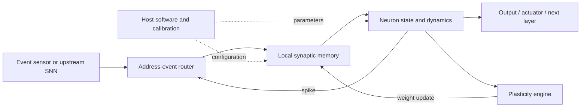

Most computers spend a surprising amount of energy moving numbers rather than multiplying them. A conventional processor repeatedly fetches weights and activations from memory, performs arithmetic, and writes the results back. Neuromorphic computing attacks that mismatch by making computation **local, sparse, stateful, and event-driven**—closer to a network of neurons and synapses than to a clocked matrix engine.

The goal is not to manufacture a silicon copy of a human brain. It is to borrow selected principles from nervous systems and redesign the full stack around them: how information is represented, how state is stored, how computation is triggered, how learning changes connections, and how hardware communicates. In the best case, the result is a machine that does not spend energy processing silence.

## Table of Contents

- [What neuromorphic computing actually mimics](#what-neuromorphic-computing-actually-mimics)
- [From continuous activations to spikes](#from-continuous-activations-to-spikes)
- [The mathematics of a spiking neuron](#the-mathematics-of-a-spiking-neuron)
- [How neuromorphic hardware is organized](#how-neuromorphic-hardware-is-organized)
- [A map of the current hardware landscape](#a-map-of-the-current-hardware-landscape)
- [Where the energy advantage comes from](#where-the-energy-advantage-comes-from)
- [Learning: from STDP to surrogate gradients](#learning-from-stdp-to-surrogate-gradients)
- [Applications that fit the architecture](#applications-that-fit-the-architecture)
- [The limits and unresolved engineering problems](#the-limits-and-unresolved-engineering-problems)
- [So what should engineers build with it](#so-what-should-engineers-build-with-it)
- [References](#references)

## What neuromorphic computing actually mimics

A biological neuron receives many small inputs through synapses, integrates them in a membrane potential, and emits a brief action potential when a threshold is crossed. The signal is not a continuously updated real-valued activation in the way a conventional artificial-neural-network layer is usually represented. It is an event in time. The synapse also has state: its strength changes with learning, and its response can decay or adapt over time.

Neuromorphic systems abstract some or all of these ideas into hardware. The strongest implementations co-locate memory and computation, use asynchronous event routing, keep neuron state near the circuits that update it, and allow learning rules to modify synapses locally. Others are less biologically faithful but still neuromorphic in spirit because they use sparse spikes, temporal state, and communication triggered by events.

> **Neuromorphic computing is a system-level design strategy, not a single circuit topology.** It can include digital CMOS chips, mixed-signal accelerators, analog physical emulators, in-memory arrays, event-based sensors, and software systems that coordinate them.

> “Neuromorphic computing is an approach to hardware design and algorithms that seeks to mimic the brain.” — IBM Research [1]

This distinction matters. A processor can be marketed as “brain-inspired” while using ordinary dense matrix multiplication internally. Conversely, a highly practical digital design can be neuromorphic without attempting to reproduce the biochemical details of a real neuron. IBM characterizes the field as designing multiple layers of a computing system to mirror selected aspects of brain efficiency rather than building an artificial duplicate of biological gray matter [1].

### The core contrast with conventional AI hardware

The easiest way to understand the architecture is to compare the unit of work. Conventional deep learning generally processes tensors: every layer consumes arrays of values, performs many multiply-accumulate operations, and synchronizes at layer or kernel boundaries. A spiking neural network (SNN) processes a stream of discrete events while maintaining internal state over time.

| Dimension | Conventional ANN accelerator | Neuromorphic SNN system |
|---|---|---|
| Basic signal | Continuous-valued activation | Discrete spike or event |
| Time | Often represented by batches or explicit timesteps | A first-class computational variable |
| Arithmetic | Dense multiply-accumulate operations | Conditional state updates and weighted events |
| Activation pattern | Frequently dense | Potentially sparse and asynchronous |
| Memory placement | Often separate from compute | Local synaptic state, near-memory, or in-memory |
| Communication | Bulk tensor movement | Addressed event packets or local fan-out |
| Learning | Usually backpropagation with global coordination | STDP, local rules, surrogate-gradient training, or hybrids |
| Best fit | Dense, high-throughput workloads | Temporal, sparse, streaming, and power-constrained workloads |

The advantage is therefore conditional rather than magical. If nearly every neuron fires at every timestep, event-driven hardware loses much of its sparsity benefit. If a workload requires dense high-precision tensor algebra with little temporal structure, a GPU or specialized tensor accelerator may remain the better tool. The engineering question is not whether a brain-inspired chip is universally more efficient; it is whether the **dataflow of the application resembles the dataflow the hardware was built to exploit** [2] [8].

## From continuous activations to spikes

A spike can be represented as a binary event at a particular time, often written as a point process:

$$
s_i(t) = \sum_f \delta(t - t_i^f),
$$

where $t_i^f$ is the time of the $f$th spike from neuron $i$ and $\delta$ is the Dirac delta function. The information is not limited to whether a neuron fires. It may be encoded in **rate**, **latency**, **phase**, or the precise pattern of inter-spike intervals.

A rate code might represent a larger input by producing more spikes during a time window. A latency code might represent a larger input by causing an earlier spike. Temporal codes can be much more economical when the important fact is that an event happened now rather than that a sensor has a particular full-frame intensity value.

This is why neuromorphic vision is closely associated with event cameras. Instead of transmitting an entire image at a fixed frame rate, an event pixel reports a change in log intensity when the change exceeds a threshold. A static region can become nearly silent, while an edge moving through the scene generates a stream of events. The sensor and the processor then share a sparse, asynchronous representation rather than forcing a frame-based pipeline to repeatedly re-encode unchanged pixels.

The same principle applies to sound, vibration, radar, tactile sensing, and industrial telemetry. The benefit appears when the signal has a high dynamic range, important transients, or long periods of inactivity. The cost is that algorithms must reason over irregular event streams, and debugging an event-based system is less intuitive than inspecting a sequence of images or tensors.

## The mathematics of a spiking neuron

The leaky integrate-and-fire (LIF) model captures the central computation with minimal hardware complexity. Between spikes, the membrane potential $V(t)$ integrates input current while relaxing toward a resting potential:

$$
\tau_m \frac{dV(t)}{dt} = -(V(t)-V_{rest}) + R_m I_{syn}(t).
$$

Here, $\tau_m$ is the membrane time constant, $R_m$ is the membrane resistance, and $I_{syn}(t)$ is the total synaptic current. When $V(t)$ reaches a threshold $V_{th}$, the neuron emits a spike and resets, typically according to

$$
\text{if } V(t) \geq V_{th}, \quad s(t)=1, \quad V(t^+) = V_{reset}.
$$

The leak is not an incidental detail. It gives the neuron a fading memory: an input that arrived long ago contributes less than an input that arrived recently. In discrete time, a simple update can be written as

```python
# Minimal discrete-time LIF update
v = v_rest + decay * (v - v_rest) + synaptic_input
spike = 1 if v >= threshold else 0
if spike:
    v = v_reset
```

Real systems add refractory periods, adaptation currents, conductance-based synapses, inhibition, dendritic compartments, or stochasticity. BrainScaleS-2, for example, implements configurable adaptive exponential integrate-and-fire dynamics in analog circuits and can disable parts of the model to obtain simpler LIF-like behavior [5]. The model chosen is an engineering compromise: richer dynamics can improve expressiveness but consume more area, memory, calibration effort, and communication bandwidth.

The synaptic input can be represented as a weighted sum of presynaptic spike trains filtered by a response kernel:

$$
I_{syn}(t) = \sum_j w_j \left(s_j * \kappa_j\right)(t),
$$

where $w_j$ is the synaptic weight and $\kappa_j$ describes how a spike's effect rises and decays. A hardware implementation does not need to multiply dense vectors at every timestep. It can update only the destinations of spikes, add a weight-dependent increment to local state, and allow that state to decay continuously or on demand.

That change in dataflow is the source of the potential efficiency gain. In an idealized sparse network, work scales with the number of emitted events and their fan-out rather than with every possible pair of input and output neurons at every timestep. In practice, routing, memory accesses, synchronization, encoding, host I/O, and peripheral circuits all contribute to energy, so the full system must be measured rather than inferred from the neuron equation alone.

## How neuromorphic hardware is organized

A practical neuromorphic chip usually divides into four interacting structures: neuron state, synaptic memory, an event-routing fabric, and control or learning logic. The exact balance separates one platform from another.



### Digital event-driven CMOS

Digital neuromorphic chips represent neuron state and synaptic weights with bits. Their strengths are programmability, reproducibility, compatibility with standard semiconductor processes, and relatively straightforward scaling. A many-core design can place thousands of compact neuron models in local tiles, connect them through a network-on-chip, and wake logic only when events arrive.

IBM TrueNorth is a canonical example. Its published design uses 4,096 neurosynaptic cores, one million digital neurons, and 256 million synapses connected by an event-driven routing infrastructure. IBM reports a 65 mW real-time chip and a fully digital 5.4-billion-transistor CMOS implementation [4]. TrueNorth demonstrates the value of extreme parallelism and local communication, but its architecture was optimized around a constrained, highly efficient inference model rather than general-purpose GPU compatibility.

Intel's Loihi family takes a more programmable direction, including on-chip learning mechanisms and configurable neuron dynamics. Intel reports that Loihi 2 provides up to 10 times faster processing than its predecessor and supplies the open-source Lava framework for developing neuro-inspired applications [3]. Such vendor figures describe a platform's direction and capabilities; they are not a universal guarantee that any SNN will be ten times faster or more energy efficient.

### Analog and mixed-signal emulation

Analog neuromorphic hardware lets physical voltages and currents evolve according to neuron and synapse dynamics. This can make the differential equations almost disappear from the execution path: the circuit's physics performs the integration and decay. Mixed-signal systems then add digital routing, configuration, calibration, and learning logic around the analog core.

BrainScaleS-2 is a particularly clear example. Its analog core contains a synaptic crossbar and configurable neuron circuits, while digital processors manage plasticity and a packet-based event network communicates spikes. The system is designed to operate at approximately 1,000 times biological speed, which is useful for rapidly running experiments and closing learning loops [5].

The trade-off is variability. Transistors and analog components differ across a die; temperature and time can shift their behavior. Calibration is therefore part of the architecture, not a one-time manufacturing afterthought. Analog systems can obtain compact, efficient physical dynamics, but the resulting model may be less deterministic and more difficult to program, reproduce, or scale than a digital equivalent.

### In-memory and memristive approaches

A synapse is fundamentally a stored connection strength. In-memory and memristive architectures attempt to place that strength inside the device that participates in computation. In a crossbar, the conductance of a device can represent a weight, and Kirchhoff's laws can perform an analog weighted sum as currents flow through many devices in parallel.

This is attractive because it reduces the movement of weights between memory and arithmetic units—the von Neumann bottleneck that becomes especially expensive in AI inference [1]. Memristive devices are also interesting because their resistance can depend on the history of applied voltage or current, providing a physical analogue of synaptic plasticity.

However, the device-level promise does not eliminate system-level problems. Device variation, limited endurance, nonlinear programming, retention, sneak paths, peripheral ADC/DAC energy, thermal effects, and manufacturing yield all matter. A dense analog array may perform a beautiful matrix operation while the data converters and control circuitry consume most of the system budget. Emerging devices should therefore be evaluated as complete computing systems, not only as impressive individual synapses.

## A map of the current hardware landscape

The major platforms illustrate that “neuromorphic” covers several different engineering philosophies.

| Platform or class | Primary strategy | Representative strengths | Representative constraints |
|---|---|---|---|
| IBM TrueNorth | Digital, many-core, event-driven CMOS | Very high parallelism; local synapses; low-power real-time inference | More constrained programming model; not a drop-in dense-ML accelerator |
| Intel Loihi 2 | Digital neuromorphic processor with programmable dynamics and learning support | Flexible SNN research; on-chip learning direction; Lava software ecosystem | Research-platform availability and workload-dependent benefits |
| SpiNNaker | Massively parallel digital processors running neural models in real time | Flexible simulation; large-scale brain modelling; useful for robotics and neuroscience | General-purpose processor activity can cost more energy than dedicated neuron circuits |
| BrainScaleS-2 | Accelerated mixed-signal physical emulation plus digital plasticity | Continuous-time dynamics; biological-time acceleration; configurable hybrid learning | Calibration, analog variation, and scaling complexity |
| Memristive / in-memory research systems | Weights embedded in analog devices or crossbars | Reduced weight movement; parallel weighted sums; potential device-level plasticity | Variation, endurance, precision, converters, and manufacturing maturity |

SpiNNaker makes the contrast with dedicated neurosynaptic arrays explicit. The Human Brain Project describes it as a massively parallel computer for large-scale real-time brain modelling and low-power robotics, with more than one million processors across 1,200 boards in the cited system description [6]. It gains flexibility by using many programmable processors to simulate neural networks, whereas TrueNorth hardwires more of the neuron-and-synapse dataflow into compact digital cores.

No row in the table is simply “the best.” A neuroscientist may prefer accelerated analog dynamics, a roboticist may need low-latency event processing and flexible control, and an embedded-AI engineer may prioritize deterministic digital behavior and a mature compiler. Platform choice follows the model, sensor, learning rule, and deployment constraints.

## Where the energy advantage comes from

Neuromorphic efficiency is usually a consequence of several savings aligning at once.

First, **event-driven execution** avoids updating inactive neurons. Second, **sparse connectivity** reduces the number of synaptic operations and messages. Third, **local memory** reduces the cost of moving weights and state across long interconnects. Fourth, **low-precision or binary communication** can reduce storage and routing overhead. Fifth, **parallelism** allows many independent synaptic events to be processed concurrently. Finally, **temporal computation** lets the network use the physics of state and decay instead of repeatedly reconstructing context from a stack of dense frames.

The gains multiply only when the application preserves those properties. A frame-based camera followed by dense encoding, a highly active SNN, a host computer that constantly copies intermediate spikes, or an inefficient event-to-tensor conversion can erase the benefit. Energy must be measured at the system boundary, including sensors, memory, interconnects, converters, host transfers, and cooling where relevant.

The benchmarking literature is especially important here. Ostrau and colleagues propose platform-spanning measurements from low-level kernels to application tasks and warn against comparing isolated operations across mismatched implementations [8]. Their full-brain simulation estimate also places contemporary neuromorphic systems at least four orders of magnitude below the biological brain in efficiency for that comparison. That result is not a failure; it is a reminder that “brain-inspired” does not mean “already as efficient as a brain.”

## Learning: from STDP to surrogate gradients

Biology-inspired local learning is commonly introduced with spike-timing-dependent plasticity (STDP). Let $\Delta t=t_{post}-t_{pre}$ be the difference between the postsynaptic and presynaptic spike times. A simple pair-based rule is

$$
\Delta w =
\begin{cases}
A_+ e^{-\Delta t/\tau_+}, & \Delta t > 0\\
-A_- e^{\Delta t/\tau_-}, & \Delta t < 0,
\end{cases}
$$

where a presynaptic spike arriving shortly before a postsynaptic spike strengthens the synapse, while the reverse ordering weakens it. The rule is local in the sense that it can be computed from pre- and post-synaptic traces plus a weight value. This maps naturally to distributed hardware and supports online adaptation, but it does not automatically deliver the accuracy or optimization behavior of backpropagation on large supervised tasks.

Modern SNN training therefore uses several families of methods. ANN-to-SNN conversion starts with a trained conventional network and maps activations into spike rates, often simplifying optimization but requiring enough timesteps to approximate analog values. Direct training uses backpropagation through time, but the threshold function is discontinuous: its derivative is zero almost everywhere or undefined at the firing threshold. Surrogate-gradient methods replace the true derivative during training with a smooth approximation, allowing gradient-based optimization while keeping discrete spikes during the forward pass.

The resulting workflow is often hybrid. Training may occur on GPUs with surrogate gradients; inference may run on neuromorphic hardware; local plasticity may adapt a deployed model to changing conditions. The practical challenge is to preserve the model's accuracy while respecting the target chip's supported neuron dynamics, weight precision, fan-out, routing limits, memory layout, and timestep budget. The algorithm cannot be designed independently of the hardware.

## Applications that fit the architecture

### Event-based perception and robotics

Event cameras naturally produce asynchronous sparse data, making them a strong match for SNNs. A robot can detect motion, estimate optical flow, classify gestures, or avoid obstacles without repeatedly processing unchanged image regions. The low latency of event-driven pipelines is useful when a control loop must react to a transient rather than wait for a complete frame.

The important systems insight is that the sensor, processor, and actuator should be designed together. Converting event streams into dense frames before inference may simplify software, but it sacrifices much of the reason to use neuromorphic hardware in the first place.

### Always-on edge intelligence

Keyword spotting, anomaly detection, vibration monitoring, wake-word detection, and wearable sensing all operate under tight power budgets. A device that spends most of its time waiting for a meaningful pattern can benefit from sparse state updates and local inference. Neuromorphic chips are particularly interesting where sending raw sensor data to the cloud costs more energy, adds latency, or creates privacy risks.

### Sensor fusion and temporal signals

Radar, inertial sensors, microphones, tactile arrays, and industrial sensors generate signals whose meaning depends on timing. SNNs can combine these streams using membrane state, delays, recurrent connections, and event-based attention-like mechanisms. The hardware benefit is strongest when the streams are sparse and the decision must be made continuously rather than once per large batch.

### Scientific modelling and brain research

Platforms such as SpiNNaker and BrainScaleS-2 are not only AI accelerators. They are experimental instruments for running large spiking networks, testing plasticity hypotheses, and studying how temporal dynamics produce computation. Acceleration can make parameter sweeps and closed-loop experiments practical, while hardware imperfections can become part of the scientific question rather than merely an obstacle.

### Optimization and unconventional computing

Recurrent spiking networks and winner-take-all circuits can represent constraint satisfaction, routing, scheduling, and associative memory. These systems do not replace classical optimization libraries in general, but they can exploit parallel physical dynamics for low-latency approximate solutions. The right comparison is against the latency, energy, and quality requirements of a specific online decision—not against every possible solver on every benchmark.

## The limits and unresolved engineering problems

**Training remains the largest software barrier.** SNNs are temporally deep even when they are spatially shallow, because the network state must be simulated across timesteps. Gradients can vanish or explode, and the most biologically local learning rules do not always match the optimization behavior demanded by modern supervised learning. Toolchains are improving, but the ecosystem is not as uniform as CUDA-based GPU development.

**Sparsity is workload-dependent.** Hardware can be event-driven, but the network may still generate too many spikes. Dense encodings, high firing rates, long simulation windows, and recurrent traffic can turn a sparse architecture into an expensive communication system. “One spike equals one cheap operation” is not a sufficient performance model.

**Precision and reproducibility are difficult.** Digital systems provide more predictable behavior but may require more memory and communication. Analog systems gain physical efficiency but need calibration and must tolerate noise, drift, and mismatch. Emerging memristive devices add further questions about device-to-device variation, retention, endurance, and programming accuracy.

**The memory wall has not disappeared; it has moved.** Local synapses reduce long-distance transfers, but large networks still require routing, mapping, buffering, and sometimes off-chip memory. The placement of a logical network onto physical cores can determine both latency and energy. A poor mapping can create congestion that dominates the neuron computation.

**Benchmarks are not yet standardized enough.** A meaningful comparison should report accuracy, latency, batch size, timesteps, spike rate, model conversion overhead, sensor and host power, memory traffic, and whether training is included. Results from a tiny event-based model should not be generalized to dense vision or language workloads without an explicit accounting.

**Brain inspiration is not brain equivalence.** Biological brains use complex dendrites, neuromodulators, glial interactions, structural plasticity, chemistry, and developmental processes that most chips omit. Neuromorphic computing is valuable because selected biological principles can be useful engineering abstractions—not because a current chip has recreated cognition.

## So what should engineers build with it

A neuromorphic design is a strong candidate when the input is naturally event-based or temporal, the device must operate continuously under a strict power budget, the application benefits from local adaptation, and the model can remain sparse. Robotics, industrial monitoring, adaptive sensors, and always-on edge inference are more plausible early targets than a generic replacement for dense GPU workloads.

Before selecting hardware, an engineering team should answer five questions:

1. Does the sensor produce changes or events, or will the system first convert dense data into artificial spikes?
2. Can the model exploit temporal state and sparse activity instead of merely emulating a dense ANN over many timesteps?
3. Is online learning required, and does the chosen chip support the needed plasticity rule and precision?
4. Can the complete system—including sensor, routing, host transfers, and calibration—meet the latency and energy target?
5. Are the benchmark and baseline matched fairly enough to justify the claimed advantage?

The most important design lesson is architectural: **neuromorphic computing works when representation, algorithm, memory, communication, and device physics are designed as one system**. A spike-based model placed unchanged on conventional hardware may deliver biological terminology without biological-style efficiency. A carefully co-designed event sensor, SNN, local memory hierarchy, and accelerator can instead turn sparsity and time into practical engineering advantages.

The field's future is therefore unlikely to be a single “brain chip” that replaces every CPU and GPU. It is more likely to be heterogeneous: conventional processors for dense workloads, GPUs for large-scale training, neuromorphic units for sparse temporal inference and adaptation, and event-based sensors feeding the whole pipeline. The winning architecture will be the one that spends computation where information actually changes.

## References

[1]: https://research.ibm.com/blog/what-is-neuromorphic-or-brain-inspired-computing "IBM Research — How neuromorphic computing takes inspiration from our brains"
[2]: https://dl.acm.org/doi/10.1145/3571155 "Rathi and Raghavan — Exploring neuromorphic computing based on spiking neural networks: Algorithms to hardware"
[3]: https://www.intel.com/content/www/us/en/research/neuromorphic-computing.html "Intel — Neuromorphic Computing and Engineering with AI"
[4]: https://research.ibm.com/publications/truenorth-design-and-tool-flow-of-a-65-mw-1-million-neuron-programmable-neurosynaptic-chip "Akopyan et al. — TrueNorth: Design and Tool Flow of a 65 mW 1 Million Neuron Programmable Neurosynaptic Chip"
[5]: https://doi.org/10.3389/fnins.2022.795876 "Pehle et al. — The BrainScaleS-2 Accelerated Neuromorphic System With Hybrid Plasticity"
[6]: https://www.humanbrainproject.eu/en/collaborate-hbp/innovation-industry/technology-catalogue/spinnaker/ "Human Brain Project — SpiNNaker"
[7]: https://doi.org/10.3390/brainsci12070863 "Yamazaki, Vo-Ho, Bulsara, and Le — Spiking Neural Networks and Their Applications: A Review"
[8]: https://doi.org/10.3389/fnins.2022.873935 "Ostrau, Klarhorst, Thies, and Rückert — Benchmarking Neuromorphic Hardware and Its Energy Expenditure"
